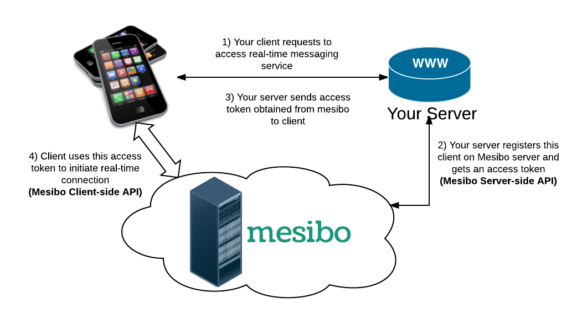
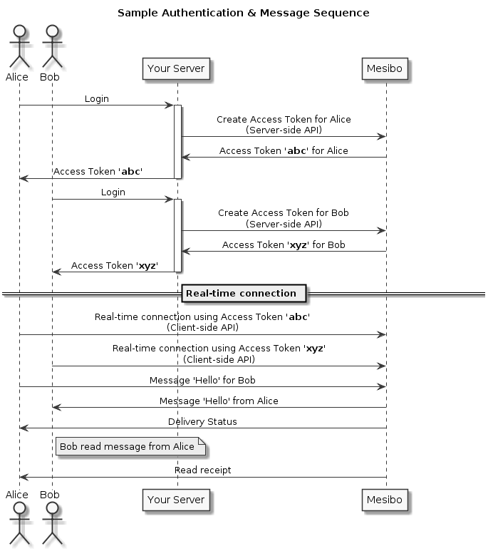



Welcome! We know you are excited to see real-time messaging in action. We promise that it won't take more than an hour to build your first real-time messaging using mesibo - a powerful, yet intuitive and elegant communication platform.

But before we begin,please ensure that you read this entire section. Also, you must have a mesibo account. This is a one-time activity, and you can use this account to build unlimited apps. Click [here](https://mesibo.com/console/#/register) to create your account

[Create Account](https://mesibo.com/console/#/register){: class="button outline-btn"}

## Introduction

1. Basic Concepts and How Mesibo Works (on this page)
2. [Messaging]({{ '/documentation/get-started/messaging' | relative_url }})
3. [Group Messaging]({{ '/documentation/get-started/group-messaging' | relative_url }})
4. [Voice and Video Calls]({{ '/documentation/get-started/voice-video-calls' | relative_url }})
4. [Ready to use UI modules]({{ '/documentation/get-started/ui-modules' | relative_url }})

## Mesibo Concepts

Mesibo is a platform for developers to **quickly develop** applications with real-time messaging, voice and video calls. However, before we go further, let's understand, what is a **Real-time Message**.

A **real-time message** could be anything, a few popular examples are:

- You are sending 'Hi' to your friends over WhatsApp is a real-time message.
- You are sending a photo OR a location to your friends over Telegram is a real-time message.
- You are sending a request to Uber for a cab is a real-time message - it's invisble to you but underneath what goes is a real-time message.
- Subsequently, Uber sending messages to group of drivers to get you a cab is a message (group message).
- Your WebRTC client sending SDP to other end is a real-time message. 

One of the distinguishing characteristics of real-time messaging is that messages are delivered as it happens, almost instantaneously. However, there are situations in which a real-time message may become non-real-time when one of the endpoints is offline. For example, you are sending a message to your friend in WhatsApp, here are possible outcomes:

  1. Your friend is online and she will get your message almost instantaneously, this is a real-time message.
  2. Your friend is offline. The server will store this message for you and it will be delivered to your friend when she is online again. This is how a real-time message (the one you sent) can become a non-real-time message.

Later, we will see how to awake remote-end on need basis so that you can maximize the possibilities of delivering your messages in real-time. 

### How Mesibo Works

Mesibo is a high performance, high-availability, asynchronous real-time messaging platform that allows your users (endpoints) to communicate with each other in real-time. Unlike other platforms, Mesibo is entirely written in C++ with state-of-the-art architecture and reliability to give you unlimited scalability from day one. Later we will see how mesibo architecture gives you an edge over homegrown implementations that are unable to scale once you reach a critical mass.

Mesibo makes it extremely simple to enable real-time communication between your users. All you have to do is:

  1. Let mesibo know about each of your users. Mesibo will create an access token for each user and give it to you (using mesibo Server-side Admin API)
  2. You give respective access tokens to your users. 
  3. Your user uses this access token in Mesibo SDK to create a real-time connection with mesibo server to send and receive real-time messages, voice and video calls. 

Isn't it absolutely simple? We handle all the complexities for you whether it is network conditions, reconnecting, reduandancy, latency, buffering and even user interface - mesibo SDK and backend takes care of everything for you. 

A more elaborate real-life scenario below in which Alice and Bob registers which your backend, each gets real-time access token from mesibo and start communication in real-time.

The power of mesibo is to make it extremely trivial to send and receive arbitrary real-time messages by using well-thought-of design patterns. In short,

  1. To send a message, invoke one of the messaging APIs. You can specify the destination (a user or a group), type of message, expiry if any, and your message. That’s about it! mesibo will send a message and also inform you about the status of messages sent in real-time.
  2. To receive messages, implement mesibo listeners (delegates in iOS). mesibo will inform you whenever you receive any messages or calls.
  3. To send and receive files, implement mesibo file transfer handler which will upload (to send) and download (on receive) file to or from your server.

That’s it. mesibo takes care of everything including connection handling, retries, error handling, flow control etc.

mesibo delivers messages instantly if the destination user is online. If not, messages will be delivered as soon as destination user comes online. This is automatic and transparent to applications, so applications sending messages do not need to worry if the receiving applications are up and running. Conversely, receiving applications do not need to worry about the status of sending application.

### What Mesibo is NOT!
Mesibo is not a collection of random recipes or quick fix code. Rather, Mesibo is a solid platform which allows you to create industrial strength communication apps with right fundamentals in place and without any shortcuts. In the next few sections and tutorials, we will learn more about real-time messaging, and calls which will not only make you more knowledgeable on Mesibo but also in general about how real-time communication works.

## Conclusion of part one

In this part, we have learnt briefly about mesibo and what it can do. 

In part 2, we will learn more about messaging and key properties like destination, type of messages, expiry, message retention etc. 

[On to Part 2 >>](messaging.md){: class="button outline-btn" style="margin-bottom: 30px; margin-right: 100%"}
