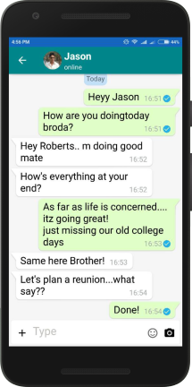
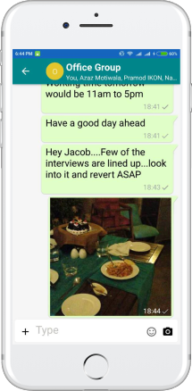



## Prerequisites

- Read the Introduction in [Part 1]({{ '/documentation/get-started/' | relative_url }}).

- Learn about Messaging and it's properties in [Part 2]({{ '/documentation/get-started/messaging/' | relative_url }} ).

## Introduction

Here in part 4, we will talk about ready to use UI Modules. 

## Mesibo UI Modules

Mesibo provides a variety of pre-built UI components that allow you to quickly add messaging, voice & video call graphical user interface in your app.  Mesibo UI modules are completely customizable. You can not only customize colors, icons etc but also customize how each message is rendered. This enables you to create powerful chatbots in no-time.

Mesibo UI modules are available as:
- Fragment (Android) 
- ViewController (iOS)
- Individual Views (android and ios)

One of the key advantages of Mesibo UI modules is that they are well tested and you need to code minimal to make fully functional graphical user interfaces. Any future enhancements are also automatically available to you. 

{:width="225px"}| {:width="225px"} | {:width="225px"}

## Customizing UI Modules
Mesibo UI modules are completely customizable and can be embedded anywhere in your application. Each UI module has a configuration object which allows you to configure the look and feel of UI and some basic components like icons, name etc. 

However, sometimes you may be required to go beyond basic customization. For example, you are creating a chatbot and you need to present custom layouts. You can easily achieve it with Mesibo UI modules. For example, Messaging UI module will let you render each message, so that you can override default UI and instead present your own when the need arises.

We will discuss more on, using and customizing Mesibo UI modules in our [tutorials]({{ '/documentation/tutorials/' | relative_url }}).

[On to Part 6 >>]({{ '/documentation/get-started/conclusion/' | relative_url  }}){: class="button outline-btn"}

