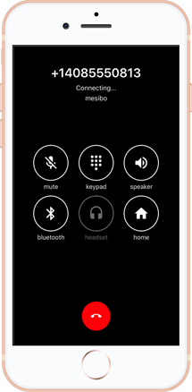



## Prerequisites

- Read the Introduction in [Part 1](index.md).

- Learn about Messaging and it's properties in [Part 2](messaging.md).

## Introduction

Here in part 4, we will talk about enabling **voice and video calls** between your users.

## Mesibo Voice and Video Calls

Mesibo allows you to enable peer-to-peer HD video and voice calls between your users, in just a few lines of code.  As with messaging, Mesibo video and voice calls are encrypted and hence secure. Mesibo does not bill any additional amount for the voice or video call API.

Mesibo calls are peer-to-peer (P2P) in nature, hence media flows directly between peers (users) without any servers in between. However, there are cases when media cannot be routed peer-to-peer. This could happen when users are behind symmetric NAT, or a highly restrictive firewall etc. In such cases, mesibo uses TURN servers for additional reliability. You can use your own TURN servers or opt for Mesibo TURN servers which are offered across continents to have the lowest possible latency.

## PSTN Calls

In addition to P2P voice and video calls, Mesibo also allows your app to make PSTN calls to worldwide mobiles and landlines. Unlike P2P calls which are free, PSTN calls are charged based on destination. 

<!--
## SIP Calls
From here you can do everything you learned about in parts 2 and 3.
-->

[On to Part 5 >>](ui-modules.md){: class="button outline-btn"}

