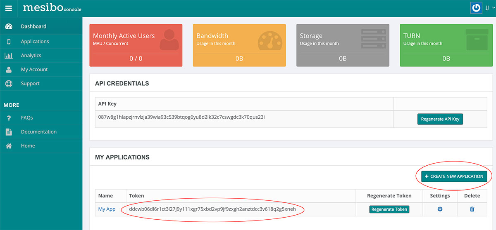



Are you excited to see real-time messaging in action? We are too. In this first tutorial, we will create a simple real-time app using Mesibo API for various platforms including `Android`, `iOS`, `Web (JavaScript)`, `C++ (Linux, Mac, Raspberry Pi)`, and `Python`. We will cover the following:

 - Basic Mesibo Settings common across all the platforms (on this page)
 - [Anatomy of a Mesibo App]({{ '/documentation/tutorials/first-app/anatomy/' | relative_url }}) - essential elements of a Mesibo App and design pattern which are common across all the platforms.
 - Platform-specific tutorials - Android, iOS, Web (JavaScript), C++ (Linux, Mac, Raspberry Pi), and Python.
 - Other topics

## Prerequisites
Ensure that you have gone through following prerequisites before you read further.

- Read the [Get Started]({{ '/documentation/get-started/' | relative_url }}) Guide.
- Read about [Type of APIs]({{ '/documentation/api/' | relative_url }})
- Read about [Admin API]({{ '/documentation/api/server-side-api/' | relative_url }})
- Signed-up and Logged-in to [Mesibo Console](https://mesibo.com/console) **(It's free)**

You are not required to go through [Real-time API]({{ '/documentation/api/real-time-api/' | relative_url }}) for now.

## Preparation

Before we start coding our first Mesibo Application, we need to perform a few steps that are common across platforms. You need to be logged-in to Mesibo console to perform these steps. 

Let’s say you are creating a new app **BingoMessage** for Android, iOS, and web. You first need to create a `Mesibo Application` which will contain of your **BingoMessage**  users, groups, setting, etc. You can create a new Application from the [Mesibo console](https://mesibo.com/console). 

Once your `Mesibo Application` is created, note down the `App token`. The App Token looks like the following:

    cn9cvk6gnm15e7lrjb2k7ggggax5h90n5x7dp4sam6kwitl2hmg4cmwabet4zgdw

We will need this `app token` to create users and groups for this `Application`. 

## Create Users (Endpoints)

Once you have created your Application, it’s time to add users and groups.  Typically, you will add users and groups dynamically on a need basis. However, for this sample app, you can create a few users and groups manually so that you can test messaging between them.

> Note that all your users and groups are local and confined to an `Application`. So there is no conflict when the same user is created by another application.

Now we will create two users by using Mesibo Admin API and the app token obtained in the previous step. The `user` is a string. It is not neccessary to use phone number, you can use whatever suits your app, as long as it's a unquie across your Application. 

- 18005550001
- 18005550002

Note that, you also need to pass the Android app id (bundle id in iOS), for example, com.mesibo.demoapp while creating users. This is a security feature that restricts your users from using the user access token on intended platforms only. 

**User Creation Request**

https://api.mesibo.com/api.php?token=cn9cvk6gnm15e7lrjb2k7ggggax5h90n5x7dp4sam6kwitl2hmg4cmwabet4zgdw&op=useradd&appid=com.mesibo.demoapp&addr=18005550001

Where  
- **token** = Application Token
- **appid** = Android or iOS app id (for example, com.mesibo.xxx). In case of C++, Python and Javascript, pass whatever appid you prefer (which you need to pass in `setAppName` API call). Note that, for security reasons, the token generated for a particular appid will only be usable on app matching that appid. 
- **addr** = end point address, for example, a user phone number.

You can find more about server-side API in the reference section. The above API returns JSON response like this,

**Response**


{"user":{"uid":"5302","token":"89314021d442c8169b2f3baf71c79caa3b026c16daedd3ee9"},"op":"useradd","result":true}


The `token` returned in the above API JSON response is the `access token`, that will be used by real-time API to connect to Mesibo real-time server (using `setAccessToken` API).

You can now create more users in a similar fashion so that you can test messaging between them. You can also send messages to a particular user using the console in ‘Users’ section.

> You can also create users from the console by clicking on ‘New User’ button from the Application settings page.

We are now all set to create our first mobile app which can send and receive real-time messages.

In the next section, we will learn to create a basic Android application. 

[On to Part 2 >>](android.md){: class="button outline-btn" style="margin-bottom: 30px; margin-right: 100%"}
